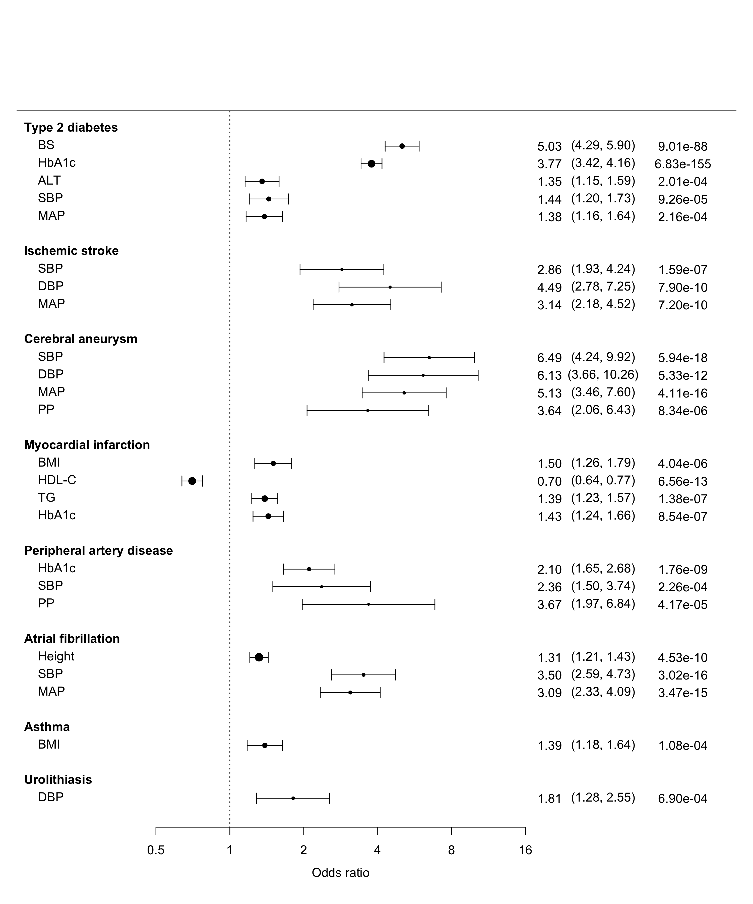

# Forest plot of MR results


## Overview

This repo provides a script to reproduce a forest plot of Mendelian randomization results in Supplementary Fig. 7 ([Kanai, M. *et al*., *Nat. Genet.* 2018](http://dx.doi.org/10.1038/s41588-018-0047-6)).

<p align="center"></p>


## Requirements

* [R](https://www.r-project.org/) with [metafor](https://CRAN.R-project.org/package=metafor) package.
  * To install these packages, type `install.packages("metafor")` in R console.

## Usage
```{sh}
Rscript forestplot.R
```

### Input: MR results (`MR.results.txt`)

This file provides the MR results from [the paper](http://dx.doi.org/10.1038/s41588-018-0047-6). Columns correspond to the following:

* `p1`: Trait 1 (clinical mesurements)
* `p2`: Trait 2 (diseases)
* `estimate`: Beta estimate
* `stderr`: Standard error
* `z`: Z score
* `p`: P-value


### Output
An example output is shown below. To get the final figure, we edited a pdf output using Adobe Illustrator.
<p align="center"></p>


## Reference

* Kanai, M., *et al*. Genetic analysis of quantitative traits in the Japanese population links cell types to complex human diseases. *Nat. Genet.* (2018) [doi:10.1038/s41588-018-0047-6](http://dx.doi.org/10.1038/s41588-018-0047-6)

## Contact
Masahiro Kanai (mkanai@g.harvard.edu)

http://mkanai.github.io/

## Links
* [JENGER](http://jenger.riken.jp/en/) (the lab website)
* [The BioBank Japan Project](https://biobankjp.org/english/index.html)
* [RIKEN Center for Integrative Medical Sciences](http://www.ims.riken.jp/english/)
* [National Bioscience Database Center Human Database](https://humandbs.biosciencedbc.jp/en/)
